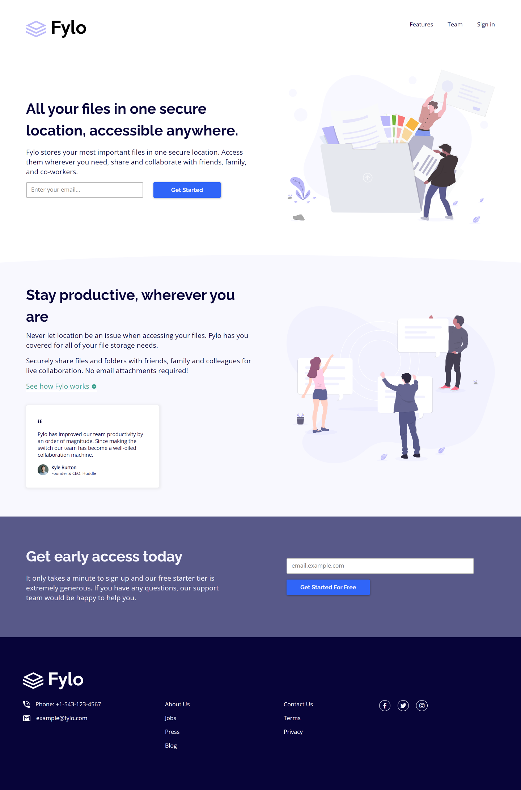
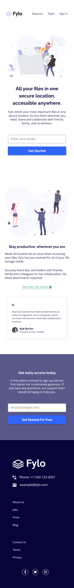

# Frontend Mentor - Fylo landing page with two column layout solution

This is a solution to the [Fylo landing page with two column layout challenge on Frontend Mentor](https://www.frontendmentor.io/challenges/fylo-landing-page-with-two-column-layout-5ca5ef041e82137ec91a50f5). Frontend Mentor challenges help you improve your coding skills by building realistic projects.

## Table of contents

-   [Overview](#overview)
    -   [The challenge](#the-challenge)
    -   [Screenshot](#screenshot)
    -   [Links](#links)
-   [My process](#my-process)
    -   [Built with](#built-with)
-   [Author](#author)

## Overview

### The challenge

Users should be able to:

-   View the optimal layout for the site depending on their device's screen size
-   See hover states for all interactive elements on the page

### Screenshot

### Links

-   Solution URL: [View Code Here](https://github.com/ChinatuL/Fylo-Landing-Page-with-Two-Column-Layout)
-   Live Site URL: [View Live Site Here](https://chinatul.github.io/Fylo-Landing-Page-With-Two-Column-Layout/)

## My process

### Built with

-   Semantic HTML5 markup
-   CSS custom properties
-   Flexbox
-   CSS Grid
-   Desktop-first workflow

## Author

-   Frontend Mentor - [@ChinatuL](https://www.frontendmentor.io/profile/ChinatuL)
-   Twitter - [@ChinatuLucia](https://www.twitter.com/ChinatuLucia)
